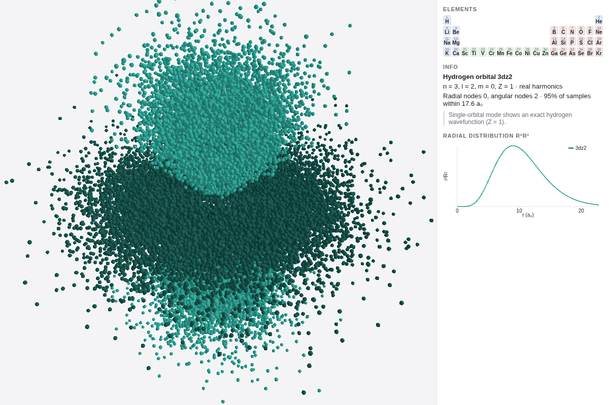
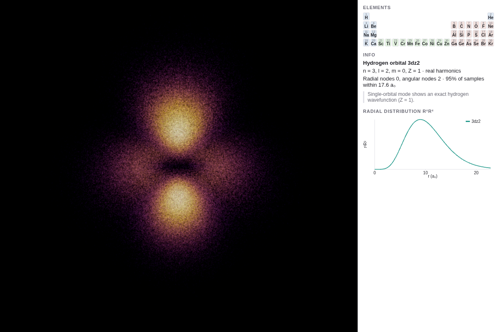
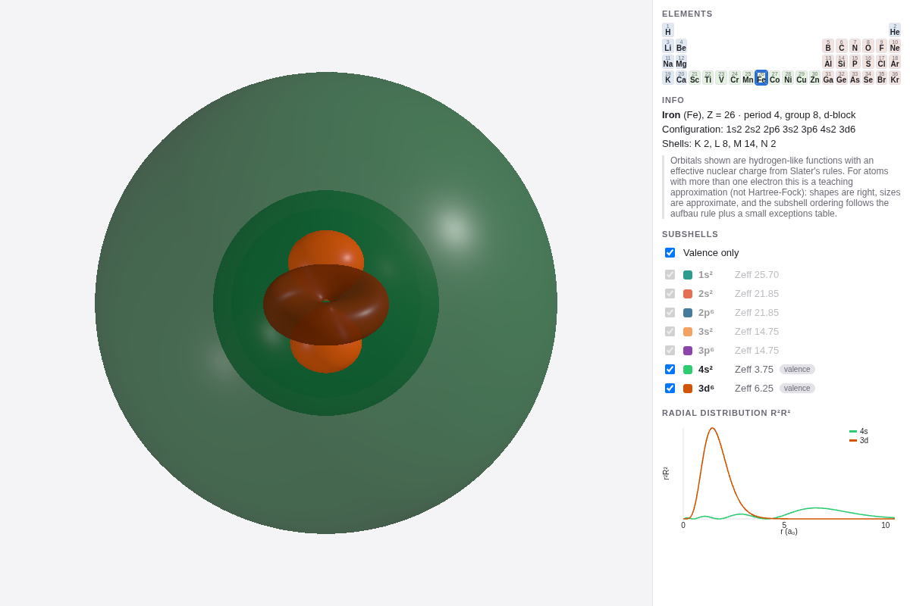

# Atom Explorer

An interactive 3D electron-orbital explorer that runs in the browser. Pick an element
(hydrogen through krypton) or choose a single hydrogen orbital by its quantum numbers,
then look at the probability cloud as lit spheres, as a glowing heat-map cloud, or as a
smooth isosurface. Everything is computed in the browser; there are no network calls
after the page loads.

| Lit spheres (default) | Glow cloud | Isosurface (iron, valence subshells) |
| --- | --- | --- |
|  |  |  |

## Running it

```bash
npm install
npm run dev        # http://localhost:5173
npm test           # Vitest: physics, sampling, meshing, state, URL
npm run build      # type-check + production bundle in dist/
```

Node 22 or newer. Vite 8, TypeScript 6, three 0.186, lil-gui 0.21, Vitest 5.

## Using it

- **Periodic table** (right panel): click an element. Each occupied subshell gets a
  color and a checkbox; "Valence only" keeps the outermost shell plus a partly filled
  d subshell.
- **Single orbital** (control panel): tick "Single orbital" and set n, l, m
  (n ≤ 7, 0 ≤ l < n, |m| ≤ l). Real orbitals (px, dz², …) are the default; untick
  "Real orbitals" for complex e^{imφ} harmonics, which are φ-symmetric and, in sphere
  mode, colored by the phase angle mφ as a hue.
- **Modes**: lit spheres with ambient occlusion, additive glow cloud with bloom and a
  choice of inferno / magma / viridis colormaps, or a marching-cubes isosurface at a
  chosen enclosed probability (default 90%).
- **Overlays**: nucleus, axes, a density slice through the x–z plane (also shown as an
  inset), the radial distribution r²R²(r) per subshell, and a flat Bohr shell view.
- **Render still**: renders the current view at twice the sample count and pixel
  ratio, stronger AO and (outside glow mode) depth of field, then downloads a PNG.
- **URL state**: the address bar tracks what you are looking at, e.g.
  `?Z=26&mode=iso&iso=0.8` or `?n=4&l=2&m=1&single=1&mode=glow&N=400000`.

Keyboard: `1` `2` `3` switch modes, `R` reset camera, `S` render still, `B` Bohr view,
`D` dark theme, `V` valence only.

## Physics

Everything lives in `src/physics/`, is framework-free, and is covered by Vitest.

- **Wavefunctions.** ψ_nlm(r, θ, φ) = R_nl(r) · Y_lm(θ, φ) in atomic units (a₀ = 1).
  R_nl uses associated Laguerre polynomials (Griffiths, *Introduction to Quantum
  Mechanics*, eq. 4.89); Y_lm uses associated Legendre functions. The real orbitals are
  the usual tesseral combinations: m > 0 ↔ cos(mφ) (x-type), m < 0 ↔ sin(|m|φ)
  (y-type), m = 0 ↔ z-type, written without the Condon–Shortley phase so px, py and
  pz are positive along their axes. Tests check normalization (∫|ψ|² = 1 to 1e-3),
  the node counts (n−l−1 radial, l angular), orthogonality, and R₁₀(0) = 2 Z^{3/2}.
- **Multi-electron atoms.** Each subshell is drawn with hydrogen-like functions and an
  effective nuclear charge Z_eff from **Slater's rules** (J. C. Slater, Phys. Rev. 36,
  57, 1930), keeping the true principal quantum number n (not Slater's n*) so radial
  nodes survive. **This is a teaching approximation, not Hartree–Fock**: shapes are
  right, sizes are approximate, and the ordering of subshells is only as good as the
  configuration table. The app says so in its info panel.
- **Electron configurations** come from the Madelung (n + l) rule plus an exceptions
  table (Cr and Cu for Z ≤ 36; entries for Nb, Mo, Ru, Rh, Pd, Ag, Pt, Au are already
  present for a later range extension). All 36 configurations are unit-tested against
  a hard-coded list. Within a subshell, electrons fill real orbitals Hund-style, and a
  subshell's cloud samples each occupied orbital in proportion to its electrons, so a
  filled subshell is spherically symmetric.
- **Sampling.** The density of one hydrogenic orbital factorizes into radial, polar and
  azimuthal parts; each is sampled by inverse-CDF lookup from a table. There is no
  rejection sampling, so high-n orbitals cost the same as 1s.
- **Isosurfaces.** |ψ|² is evaluated on a grid (default 96³), the density threshold that
  encloses the requested probability is found by sorting, and marching cubes
  (Lorensen & Cline, 1987) extracts the surface with gradient normals. The lookup tables
  come from three.js's MIT-licensed `MarchingCubes.js`; the meshing loop is written here.
- All sampling and meshing run in a Web Worker and come back as transferable typed
  arrays, so the UI never freezes.

## Performance

Measured on this machine (NVIDIA RTX 4060 Ti, headless Chromium via ANGLE/Vulkan,
1280×800, 2026-10-09). The frame counter is capped by vsync at 60.

| Scene | fps |
| --- | --- |
| 50k lit spheres + GTAO | 60 |
| 150k lit spheres + GTAO | 60 |
| 300k glow points + bloom | 60 |
| 500k glow points + bloom | 60 |
| Isosurface, 96³ and 128³ grids | 60 |

First preview after an orbital change: 139 ms on a cold start (includes worker start),
under 10 ms afterwards; a full 50k-sphere set follows within ~30 ms; a 96³ isosurface in
~330 ms. Fifty mode/orbital switches leave `renderer.info.memory.geometries` unchanged.
Integrated-GPU numbers have not been measured.

## Licenses and data

- Code: original, in this repository.
- Element table (`src/physics/elements.ts`): typed by hand; atomic numbers, groups,
  periods, blocks and the standard CPK display colors are facts, not copied data files.
- Colormaps: inferno, magma and viridis by Nathaniel J. Smith, Stefan van der Walt and
  Eric Firing, released under CC0 (https://github.com/BIDS/colormap); regenerate with
  `node scripts/gen-colormaps.mjs <path to colormaps.py>`.
- Marching-cubes tables: from three.js (MIT); regenerate with `node scripts/gen-mctables.mjs`.
- Dependencies: three (MIT), lil-gui (MIT), Vite, TypeScript, Vitest.

## Layout

```
src/physics/   wavefunctions, Slater, configurations, sampler, grid, marching cubes (pure, tested)
src/worker/    Web Worker protocol, worker, cached client
src/render/    scene manager, composer, sphere cloud, glow cloud, isosurface, overlays, Bohr, still
src/ui/        lil-gui controls, periodic table, subshell list, plots, URL state, shortcuts
src/app.ts     state -> worker -> render orchestration
docs/          design spec, implementation plan, screenshots
```
